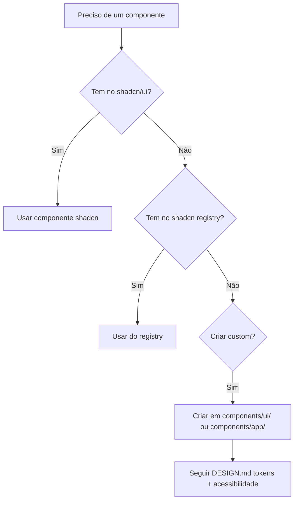

# AGENTS.md — PLCO Suite

> Instruções para agentes de IA trabalhando neste projeto.

---

## Arquivos de Referência Obrigatórios

| Arquivo | Propósito |
|---------|-----------|
| `PLAN.md` | Planejamento geral, fases, features, schema do banco |
| `DESIGN.md` | Design system baseado em Things 3 (cores, tipografia, componentes de tela) |

Sempre leia ambos antes de começar a codificar.

---

## Regra de Conduta #1 — shadcn/ui Primeiro

**Máximo possível, use componentes do shadcn/ui. Só crie componentes customizados quando não existir equivalente no shadcn.**

O DESIGN.md define a **cara** (aparência, estilo, filosofia visual). O shadcn/ui fornece os **ossos** (componentes funcionais, acessíveis, testados). Aplicamos os tokens do DESIGN.md **em cima** dos componentes shadcn via Tailwind — nunca reinventamos um componente que já existe.

### Mapeamento: DESIGN.md → shadcn/ui

| Componente DESIGN.md | Componente shadcn | Observação |
|---------------------|-------------------|------------|
| Task Row | `Card` + `Checkbox` + `Badge` | Card com padding reduzido |
| Sidebar | `Sidebar` (nativo shadcn) | Personalizar com tokens DESIGN.md |
| Detail View (tarefa) | `Sheet` ou `Dialog` | Sheet desliza de baixo no mobile |
| Date Picker (Jump Start) | `Popover` + `Calendar` | Calendar + botões de atalho |
| Quick Find (busca) | `Command` (cmdk) | Já vem com busca, atalhos, keyboard nav |
| Seletor de Projeto/Área | `Combobox` ou `Command` | Command com grupos |
| Tags | `Badge` variants | Cores customizadas |
| Progress Pie (projeto) | `Progress` | Adaptar para circular se necessário |
| Tabs de seções | `Tabs` ou `Navigation Menu` | Tabs para as seções (Hoje, Breve, etc.) |
| Modal de confirmação | `Alert Dialog` | — |
| Settings / Formulários | `Form` + `Input` + `Select` etc. | shadcn forms com React Hook Form |
| Avatar de usuário | `Avatar` | — |
| Toast / Notificações | `Sonner` (toast) | — |

### Componentes que NÃO existem no shadcn (criar custom)

| Necessário | Justificativa |
|-----------|---------------|
| **Bottom Dock / Bottom Tab Bar** | shadcn não tem um componente de navegação inferior para mobile |
| **Magic Plus Button** | Botão "+" flutuante com drag para posicionar |
| **Task Row** (completo) | shadcn não tem um "linha de tarefa" com checkbox + metadados + badges |
| **Seções com drag-and-drop** | Reordenar tarefas entre seções (Inbox → Hoje → etc.) |
| **Jump Start Popover** | Date picker com atalhos "Hoje", "Esta Noite", "Algum Dia" |
| **Esta Noite divider** | Divisor estilizado com cor índigo |
| **Anytime group by project** | Agrupamento de tarefas soltas por projeto na seção Qualquer Hora |
| **Someday faded style** | Opacidade reduzida em tarefas "Algum Dia" |

### Como decidir



---

## Estrutura de Componentes

```
src/components/
├── ui/                  # Componentes shadcn (gerados pelo CLI)
│   ├── button.tsx
│   ├── card.tsx
│   ├── dialog.tsx
│   └── ...
├── app/                 # Componentes custom do app
│   ├── task-row.tsx
│   ├── bottom-dock.tsx
│   ├── magic-plus.tsx
│   ├── jump-start.tsx
│   ├── section-list.tsx
│   └── ...
└── landing/             # Componentes da landing page
    ├── hero.tsx
    ├── features.tsx
    └── ...
```

---

## Convenções de Código

- **TypeScript estrito** — sem `any`, sem `@ts-ignore`
- **Tailwind CSS** — sempre usar tokens do DESIGN.md (ex: `bg-canvas`, `text-ink`, `border-hairline`)
- **Server Components primeiro** — Next.js App Router, colocar interatividade apenas onde necessário
- **Client Components** — só o que precisa de interação (tarefas, drag, etc.). Marcar com `"use client"`
- **Supabase** — chamadas de banco em Server Components ou Route Handlers; usar client components só para realtime
- **Zustand** — estado global mínimo (núcleo atual, seção ativa, etc.)
- **shadcn CLI** para adicionar componentes: `npx shadcn@latest add <componente>`

---

## Comandos Úteis

| Comando | Descrição |
|---------|-----------|
| `npm run dev` | Iniciar dev server |
| `npm run build` | Build de produção |
| `npm run lint` | Verificar lint |
| `npm run typecheck` | Verificar tipos |
| `npx shadcn@latest add <nome>` | Adicionar componente shadcn |
| `npx shadcn@latest update` | Atualizar componentes shadcn |

---

---

## Procedimento de Commit

Sempre que o usuário pedir para fazer commit, siga **rigorosamente** esta ordem:

### 1. Atualizar CHANGELOG.md
- Adicione uma entrada com a **nova versão**, data, e todas as mudanças categorizadas em:
  - `### Added` — novas funcionalidades
  - `### Changed` — alterações em funcionalidades existentes
  - `### Fixed` — correções de bugs
  - `### Removed` — funcionalidades removidas
- O texto deve estar pronto para copiar manualmente para uma release no GitHub

### 2. Atualizar versões
- **`package.json`**: incremente o campo `"version"` seguindo semver (`0.1.0` → `0.2.0` → etc.)
- **`src/components/app/settings-sheet.tsx`**: sincronize a constante `APP_VERSION` com o valor de `package.json`

### 3. Fazer commit
- **Conventional Commit Pattern** obrigatório:
  - `feat:` — nova funcionalidade
  - `fix:` — correção de bug
  - `refactor:` — refatoração sem mudança de comportamento
  - `perf:` — otimização de performance
  - `docs:` — documentação
  - `chore:` — tarefas de manutenção (build, deps, config)
- Mensagem clara e concisa (máximo ~72 chars no título)
- Use `git add -A` para stage de todos os arquivos

### 4. Criar tag de versão
- `git tag -a v*.*.* -m "v*.*.* — resumo curto"`
- Exemplo: `git tag -a v0.2.0 -m "v0.2.0 — Overdue filter, iOS keyboard fix, hydration fix"`

### 5. Verificar
- `git status` deve mostrar working tree limpo
- `git log --oneline -3` para confirmar o commit

---

## Ordem de Leitura para Novos Agentes

1. `DRAFTS.md` — visão geral do produto
2. `PLAN.md` — escopo, fases, schema
3. `DESIGN.md` — design system e UI
4. `AGENTS.md` — (este arquivo) regras de conduta
